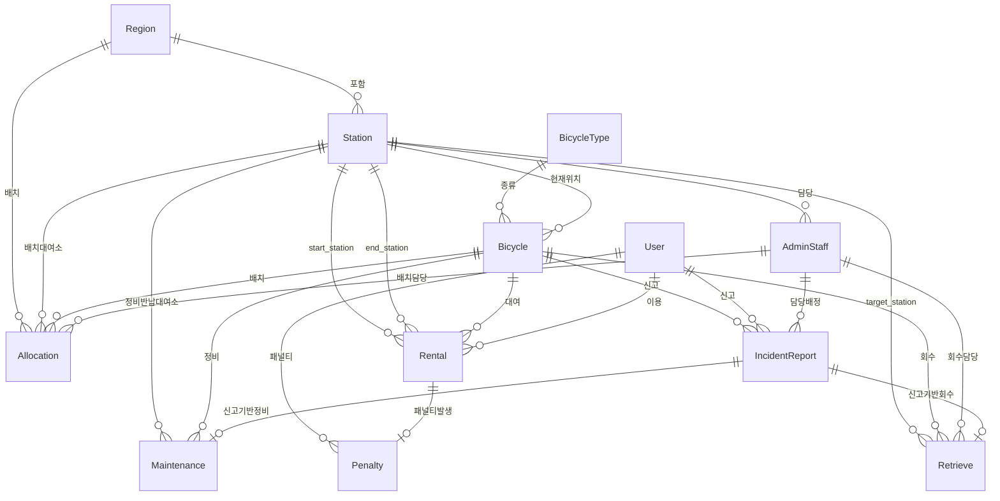

# 시흥시 공공 자전거 대여 서비스 — DB 설계

## 1. 프로젝트 개요

1. 경기도 시흥시의 열악한 교통환경을 개선하기 위해 시민 대상 공공 자전거 대여 서비스를 기획한다.
2. 서비스 운영에 필요한 엔터티를 **12개** 정의하고, MySQL 8.0 기반 관계형 데이터베이스를 설계한다.
3. 시흥시 전역 관광지·교통 요지에 **유인 대여소**를 설치하고, 각 대여소에 `AdminStaff`를 상주시켜 운영한다.
4. 시민은 회원 가입 후 대여소에서 자전거를 대여하며, **반납은 시흥시 내 모든 대여소**에서 가능하다.
5. 자전거 종류는 **일반(1인)**, **2인용**, **어린이** 3종으로 구분한다. 어린이 자전거는 만 13세 미만(초등학생 이하)만 대여 가능하며, 연령은 `User.birth_date` 기준 대여 시점에 실시간으로 계산한다.
6. 기본 이용은 **무료**이며, 미반납 시 **미납일수 × 10일** 대여 금지 패널티가 발생하고 만료 후 자동 해제된다.
7. 자전거 단말기가 GPS 위치를 주기적으로 갱신하며, 시흥시 경계 이탈 감지 시 자동으로 회수 프로세스가 시작된다.

---

## 2. 설계 목표

- 시흥시가 외부적으로 보유한 지역별 수요 데이터를 기반으로 관리자가 자전거 배치 전략을 수립할 수 있도록 배치 이력(`Allocation`) 관리 지원 (수요 데이터 자체는 본 DB에 저장하지 않음)
- 사용자 가입부터 대여, 반납까지 전 과정 데이터 추적
- 유지보수와 고장 신고를 포함한 운영 관제 데이터 축적
- 확장 가능한 스키마 구조 (제3정규형 기반) 확보

---

## 3. 핵심 기능 범위

| 기능 영역 | 세부 내용 | 관련 엔터티 |
|----------|----------|-----------|
| 회원 관리 | 가입, 상태 관리, 이용 제한 처리 | `User`, `Penalty` |
| 자전거 관리 | 재고, 상태, 종류별 규격 관리 | `Bicycle`, `BicycleType` |
| 대여소 관리 | 지역별 대여소, 배치 현황 | `Station`, `Region`, `Allocation` |
| 대여/반납 처리 | 시작·반납 대여소, 이용 시간/거리 계산 | `Rental` |
| 운영 관리 | 정비 이력, 신고 이력, 관리자 처리 기록 | `AdminStaff`, `Maintenance`, `IncidentReport` |
| 자전거 회수 | 구역 이탈·미반납 자전거 회수 이력 | `Retrieve` |

---

## 4. 엔터티 목록 (12개)

> 번호 순서는 테이블 생성 시 FK 의존성 순서와 일치한다.

| # | 엔터티명 | 설명 |
|---|----------|------|
| 1 | `Region` | 지역 (동 단위) |
| 2 | `BicycleType` | 자전거 종류 (일반 / 어린이 / 2인용) |
| 3 | `Station` | 대여소 |
| 4 | `Bicycle` | 자전거 개체 |
| 5 | `User` | 서비스 이용자 |
| 6 | `AdminStaff` | 운영 관리자 |
| 7 | `Rental` | 대여 이력 |
| 8 | `IncidentReport` | 고장 / 민원 신고 |
| 9 | `Maintenance` | 정비 이력 |
| 10 | `Retrieve` | 자전거 회수 이력 |
| 11 | `Penalty` | 미반납 패널티 |
| 12 | `Allocation` | 자전거 배치 이력 |

---

## 5. 엔터티별 속성 완전 정의

### 5.1 Region (지역)

| 컬럼명 | 타입 | 제약 | 설명 |
|--------|------|------|------|
| `region_id` | INT | PK, AUTO_INCREMENT | 지역 ID |
| `region_name` | VARCHAR(50) | NOT NULL, UNIQUE | 동 이름 |
| `created_at` | DATETIME | DEFAULT NOW() | 등록일시 |

---

### 5.2 BicycleType (자전거 종류)

| 컬럼명 | 타입 | 제약 | 설명 |
|--------|------|------|------|
| `type_id` | INT | PK, AUTO_INCREMENT | 종류 ID |
| `type_name` | VARCHAR(50) | NOT NULL, UNIQUE | 종류명 (일반 / 어린이 / 2인용) |
| `max_passenger` | TINYINT | NOT NULL, DEFAULT 1 | 최대 탑승 인원 |
| `inspection_cycle` | INT | NOT NULL, DEFAULT 30 | 점검 주기 (일) |
| `description` | TEXT | | 종류 설명 |

> 종류별 `max_passenger` 기본값: 일반 `1`, 어린이 `1`, 2인용 `2`. 어린이 자전거는 만 13세 미만 사용자만 대여 가능하다.

---

### 5.3 Station (대여소)

| 컬럼명 | 타입 | 제약 | 설명 |
|--------|------|------|------|
| `station_id` | INT | PK, AUTO_INCREMENT | 대여소 ID |
| `region_id` | INT | FK → Region, NOT NULL | 소속 지역 |
| `station_name` | VARCHAR(100) | NOT NULL | 대여소 명칭 |
| `address` | VARCHAR(255) | NOT NULL | 주소 |
| `contact` | VARCHAR(20) | | 연락처 |
| `latitude` | DECIMAL(10,7) | | GPS 위도 |
| `longitude` | DECIMAL(10,7) | | GPS 경도 |
| `total_docks` | INT | NOT NULL, DEFAULT 0 | 총 거치대 수 |
| `station_status` | ENUM | DEFAULT '운영중' | 운영중 / 휴관 / 정비중 |
| `created_at` | DATETIME | DEFAULT NOW() | 등록일시 |

---

### 5.4 Bicycle (자전거)

| 컬럼명 | 타입 | 제약 | 설명 |
|--------|------|------|------|
| `bicycle_id` | INT | PK, AUTO_INCREMENT | 자전거 ID |
| `type_id` | INT | FK → BicycleType, NOT NULL | 자전거 종류 |
| `bike_status` | ENUM | DEFAULT '정상' | 정상 / 대여중 / 정비중 / 분실 / 회수중 |
| `current_station_id` | INT | FK → Station, NULL 허용 | 현재 위치 대여소 (대여중·정비중·분실·회수중 시 NULL) |
| `gps_latitude` | DECIMAL(10,7) | NULL 허용 | 실시간 GPS 위도 (대여중일 때만 갱신, 반납·회수 완료 시 NULL) |
| `gps_longitude` | DECIMAL(10,7) | NULL 허용 | 실시간 GPS 경도 (대여중일 때만 갱신, 반납·회수 완료 시 NULL) |
| `gps_updated_at` | DATETIME | NULL 허용 | GPS 최종 갱신 일시 |
| `registered_at` | DATETIME | DEFAULT NOW() | 등록일시 |

---

### 5.5 User (사용자)

| 컬럼명 | 타입 | 제약 | 설명 |
|--------|------|------|------|
| `user_id` | INT | PK, AUTO_INCREMENT | 사용자 ID |
| `name` | VARCHAR(50) | NOT NULL | 실명 |
| `birth_date` | DATE | NOT NULL | 생년월일 |
| `phone` | VARCHAR(20) | NOT NULL, UNIQUE | 연락처 |
| `address` | VARCHAR(255) | | 주소 |
| `user_status` | ENUM | DEFAULT '정상' | 정상 / 정지 |
| `created_at` | DATETIME | DEFAULT NOW() | 등록일시 |

---

### 5.6 AdminStaff (운영 관리자)

| 컬럼명 | 타입 | 제약 | 설명 |
|--------|------|------|------|
| `staff_id` | INT | PK, AUTO_INCREMENT | 관리자 ID |
| `staff_name` | VARCHAR(50) | NOT NULL | 성명 |
| `phone` | VARCHAR(20) | NOT NULL, UNIQUE | 연락처 |
| `station_id` | INT | FK → Station, NULL 허용 | 담당 대여소 |
| `is_active` | TINYINT(1) | DEFAULT 1 | 재직 여부 |
| `created_at` | DATETIME | DEFAULT NOW() | 등록일시 |

---

### 5.7 Rental (대여 이력)

| 컬럼명 | 타입 | 제약 | 설명 |
|--------|------|------|------|
| `rental_id` | INT | PK, AUTO_INCREMENT | 대여 ID |
| `user_id` | INT | FK → User, NOT NULL | 이용 사용자 |
| `bicycle_id` | INT | FK → Bicycle, NOT NULL | 대여 자전거 |
| `start_station_id` | INT | FK → Station, NOT NULL | 대여 시작 대여소 |
| `end_station_id` | INT | FK → Station, NULL 허용 | 반납 대여소 (대여중 NULL) |
| `rental_date` | DATE | NOT NULL | 대여 날짜 (쿼리 최적화용) |
| `start_time` | DATETIME | NOT NULL | 대여 시작 일시 |
| `end_time` | DATETIME | NULL 허용 | 반납 일시 |
| `duration_min` | INT | NULL 허용 | 이용 시간 (분) |
| `distance_km` | DECIMAL(7,3) | NULL 허용 | 이용 거리 (km) |
| `rental_status` | ENUM | DEFAULT '대여중' | 대여중 / 반납 / 미반납 |

> `rental_date`는 `start_time`에서 도출 가능하나, 날짜 기반 집계 쿼리 성능을 위해 의도적으로 분리 저장한다.

---

### 5.8 IncidentReport (고장/민원 신고)

| 컬럼명 | 타입 | 제약 | 설명 |
|--------|------|------|------|
| `incident_id` | INT | PK, AUTO_INCREMENT | 신고 ID |
| `user_id` | INT | FK → User, NULL 허용 | 신고자 (NULL = 관리자 직접 접수) |
| `bicycle_id` | INT | FK → Bicycle, NOT NULL | 신고 대상 자전거 |
| `incident_type` | ENUM | NOT NULL | 고장 / 방치 / 분실 / 기타 |
| `description` | TEXT | | 신고 내용 |
| `reported_at` | DATETIME | DEFAULT NOW() | 신고 일시 |
| `incident_status` | ENUM | DEFAULT '접수' | 접수 / 처리중 / 완료 |
| `assigned_staff_id` | INT | FK → AdminStaff, NULL 허용 | 담당 관리자 |
| `resolved_at` | DATETIME | NULL 허용 | 처리 완료 일시 |

---

### 5.9 Maintenance (정비 이력)

> 자전거 정비는 **외부 업체(외주)에 위탁**하여 진행한다. 본 테이블은 "정비를 외주에 맡겼다"는 사실과 자전거 반납 결과만을 기록하며, 외주 업체의 작업자·정비 방법은 관리하지 않는다.

| 컬럼명 | 타입 | 제약 | 설명 |
|--------|------|------|------|
| `maintenance_id` | INT | PK, AUTO_INCREMENT | 정비 ID |
| `bicycle_id` | INT | FK → Bicycle, NOT NULL | 정비 자전거 |
| `incident_id` | INT | FK → IncidentReport, NULL 허용 | 연계 신고 (정기점검 의뢰 시 NULL) |
| `maintenance_type` | ENUM | NOT NULL | 정기점검 / 수리 / 청소 |
| `description` | TEXT | | 정비 의뢰 내용 |
| `return_station_id` | INT | FK → Station, NULL 허용 | 정비 완료 후 자전거 반납 대여소 (의뢰 시 지정, 완료 시 확정) |
| `started_at` | DATETIME | NOT NULL | 정비 의뢰 일시 |
| `ended_at` | DATETIME | NULL 허용 | 정비 완료(자전거 반납) 일시 |
| `maintenance_status` | ENUM | DEFAULT '진행중' | 진행중 / 완료 |

---

### 5.10 Retrieve (자전거 회수 이력)

| 컬럼명 | 타입 | 제약 | 설명 |
|--------|------|------|------|
| `retrieve_id` | INT | PK, AUTO_INCREMENT | 회수 ID |
| `bicycle_id` | INT | FK → Bicycle, NOT NULL | 회수 자전거 |
| `staff_id` | INT | FK → AdminStaff, **NULL 허용** | 담당 회수 요원 (자동 생성 시 NULL, 이후 배정) |
| `incident_id` | INT | FK → IncidentReport, NULL 허용 | 연계 신고 (자동 감지 시 NULL) |
| `retrieve_latitude` | DECIMAL(10,7) | | 발견 위치 위도 |
| `retrieve_longitude` | DECIMAL(10,7) | | 발견 위치 경도 |
| `retrieve_location` | VARCHAR(255) | NOT NULL | 발견 주소 |
| `target_station_id` | INT | FK → Station, NOT NULL | 반납 목표 대여소 |
| `retrieved_at` | DATETIME | DEFAULT NOW() | 회수 시작 일시 |
| `completed_at` | DATETIME | NULL 허용 | 반납 완료 일시 |
| `retrieve_reason` | ENUM | NOT NULL | 방치 / 미반납 / 구역이탈 / 기타 |
| `retrieve_status` | ENUM | DEFAULT '진행중' | 진행중 / 완료 |

---

### 5.11 Penalty (패널티)

| 컬럼명 | 타입 | 제약 | 설명 |
|--------|------|------|------|
| `penalty_id` | INT | PK, AUTO_INCREMENT | 패널티 ID |
| `user_id` | INT | FK → User, NOT NULL | 대상 사용자 |
| `rental_id` | INT | FK → Rental, NOT NULL, UNIQUE | 미반납 대여 건 (건당 1개) |
| `penalty_days` | INT | NOT NULL | 대여 금지 일수 |
| `ban_start` | DATE | NOT NULL | 금지 시작일 |
| `created_at` | DATETIME | DEFAULT NOW() | 등록일시 |

---

### 5.12 Allocation (자전거 배치 이력)

| 컬럼명 | 타입 | 제약 | 설명 |
|--------|------|------|------|
| `allocation_id` | INT | PK, AUTO_INCREMENT | 배치 ID |
| `bicycle_id` | INT | FK → Bicycle, NOT NULL | 배치 자전거 |
| `region_id` | INT | FK → Region, NOT NULL | 배치 지역 (`station_id = NULL`인 경우 지역만 지정) |
| `station_id` | INT | FK → Station, NULL 허용 | 배치 대여소 (미정 시 NULL, 이후 확정 시 업데이트) |
| `allocated_by` | INT | FK → AdminStaff, NOT NULL | 배치 담당자 |
| `allocated_at` | DATETIME | DEFAULT NOW() | 배치 일시 |
| `note` | TEXT | | 비고 |

---

## 6. 관계 설계 (ERD 기준)

### 6.1 ERD 다이어그램



---

### 6.2 관계 목록 (카디널리티 상세)

| # | 부모 엔터티 | 자식 엔터티 | 카디널리티 | FK 컬럼 | 비고 |
|---|------------|------------|-----------|---------|------|
| 1 | Region | Station | 1:N | `Station.region_id` | 한 지역에 여러 대여소 |
| 2 | Region | Allocation | 1:N | `Allocation.region_id` | 지역 단위 배치 관리 |
| 3 | BicycleType | Bicycle | 1:N | `Bicycle.type_id` | 종류별 자전거 분류 |
| 4 | Station | Bicycle | 1:N | `Bicycle.current_station_id` | 현재 위치 (NULL 가능) |
| 5 | Station | AdminStaff | 1:N | `AdminStaff.station_id` | 담당 대여소 (관리자 역할은 NULL 가능) |
| 6 | Station | Rental | 1:N | `Rental.start_station_id` | 대여 시작 대여소 |
| 7 | Station | Rental | 1:N | `Rental.end_station_id` | 반납 대여소 (NULL 가능, 대여중) |
| 8 | Station | Retrieve | 1:N | `Retrieve.target_station_id` | 회수 목표 대여소 |
| 9 | Station | Allocation | 1:N | `Allocation.station_id` | 배치 대여소 (NULL 가능) |
| 10 | Station | Maintenance | 1:N | `Maintenance.return_station_id` | 외주 정비 완료 후 자전거 반납 대여소 (NULL 가능) |
| 11 | Bicycle | Rental | 1:N | `Rental.bicycle_id` | 자전거 대여 이력 |
| 12 | Bicycle | IncidentReport | 1:N | `IncidentReport.bicycle_id` | 자전거 신고 이력 |
| 13 | Bicycle | Maintenance | 1:N | `Maintenance.bicycle_id` | 자전거 정비 이력 |
| 14 | Bicycle | Retrieve | 1:N | `Retrieve.bicycle_id` | 자전거 회수 이력 |
| 15 | Bicycle | Allocation | 1:N | `Allocation.bicycle_id` | 자전거 배치 이력 |
| 16 | User | Rental | 1:N | `Rental.user_id` | 사용자 대여 이력 |
| 17 | User | IncidentReport | 1:N | `IncidentReport.user_id` | 사용자 신고 이력 (NULL 가능) |
| 18 | User | Penalty | 1:N | `Penalty.user_id` | 사용자 패널티 이력 |
| 19 | Rental | Penalty | 1:0..1 | `Penalty.rental_id` (UNIQUE) | 한 미반납 건당 패널티 1건 |
| 20 | AdminStaff | IncidentReport | 1:N | `IncidentReport.assigned_staff_id` | 담당 배정 (NULL 가능) |
| 21 | AdminStaff | Retrieve | 1:N | `Retrieve.staff_id` | 회수 담당자 (NULL 가능) |
| 22 | AdminStaff | Allocation | 1:N | `Allocation.allocated_by` | 배치 담당자 |
| 23 | IncidentReport | Maintenance | 1:0..1 | `Maintenance.incident_id` (NULL 가능) | 신고 기반 정비 외주 연계 |
| 24 | IncidentReport | Retrieve | 1:0..1 | `Retrieve.incident_id` (NULL 가능) | 신고 기반 회수 연계 |

---

## 7. 비즈니스 규칙

### 7.1 대여 가능 조건

사용자가 자전거를 대여하려면 다음 조건을 **모두** 충족해야 한다.

1. `User.user_status = '정상'`
2. 해당 사용자의 `Rental.rental_status = '대여중'`인 레코드가 없어야 함 (1인 1대 제한)
3. 해당 사용자의 `Penalty` 중 `ban_start ≤ CURRENT_DATE AND (ban_end IS NULL OR ban_end ≥ CURRENT_DATE)`인 레코드가 없어야 함
4. `Bicycle.bike_status = '정상'`이어야 함
5. `TIMESTAMPDIFF(YEAR, User.birth_date, CURRENT_DATE) < 13`(만 13세 미만, 초등학생 이하)인 경우 `BicycleType.type_name = '어린이'` 자전거만 대여 가능

> 조건 3은 `Penalty` 테이블을 직접 조회한다. `User.user_status`만으로는 패널티 만료 여부를 정확히 판단할 수 없다.

---

### 7.2 대여 처리 흐름

```
[대여 요청]
  └─▶ 조건 검증 (7.1)
      └─▶ Rental INSERT (rental_status = '대여중', end_station_id = NULL)
          └─▶ Bicycle.bike_status → '대여중'
              Bicycle.current_station_id → NULL
              Bicycle.gps_latitude / gps_longitude → 단말기 갱신 시작
```

---

### 7.3 반납 처리 흐름

> 반납은 대여 시작 대여소에 국한하지 않고, **시흥시 내 모든 운영 중인 대여소**에서 가능하다.

```
[반납 요청]
  └─▶ Rental UPDATE
        end_station_id = 반납 대여소 (시흥시 내 임의 운영 중 대여소)
        end_time = NOW()
        duration_min = TIMESTAMPDIFF(MINUTE, start_time, end_time)
        rental_status → '반납'
      └─▶ Bicycle.bike_status → '정상'
          Bicycle.current_station_id → 반납 대여소
          Bicycle.gps_latitude / gps_longitude / gps_updated_at → NULL
```

---

### 7.4 미반납 패널티 처리

- 매일 자정 배치 작업이 `rental_status = '대여중'`이며 `start_time`으로부터 **1일(24시간) 이상** 경과한 Rental을 감지한다.
- 감지된 Rental의 `rental_status → '미반납'`
- `n = 감지 시점 기준 경과일수 (DATEDIFF(CURRENT_DATE, rental_date))`
- `Penalty` 레코드 생성:
  - `penalty_days = n × 10`
  - `ban_start = CURRENT_DATE`
  - `ban_end = ban_start + penalty_days`
- `User.user_status → '정지'`
- 패널티 기간 만료(`ban_end < CURRENT_DATE`) 시 `User.user_status → '정상'` 자동 복구
- 동일 사용자에게 복수의 활성 패널티가 존재하는 경우, **가장 늦은 `ban_end`**를 기준으로 이용 제한을 적용한다.

---

### 7.5 신고 유형별 처리 흐름

#### 고장 신고 → 정비 외주 연계

```
IncidentReport 접수 (incident_type = '고장')
  └─▶ IncidentReport.incident_status → '처리중'
      assigned_staff_id 배정 (외주 정비 조율 담당 관리자)
      └─▶ Maintenance INSERT  ← 외주 정비 의뢰 등록
            incident_id       = 해당 신고 ID
            maintenance_type  = '수리'
            return_station_id = 정비 완료 후 자전거를 인수할 대여소 (의뢰 시 지정)
            Bicycle.bike_status → '정비중'
            Bicycle.current_station_id → NULL
          └─▶ 외주 업체 정비 완료·자전거 반납 시
                Maintenance.maintenance_status → '완료'
                Maintenance.ended_at          = NOW()
                Maintenance.return_station_id → (미확정이었을 경우 반납 대여소 확정)
                IncidentReport.incident_status → '완료'
                IncidentReport.resolved_at     = NOW()
                Bicycle.bike_status            → '정상'
                Bicycle.current_station_id     → Maintenance.return_station_id
```

#### 방치 신고 → 회수 연계

```
IncidentReport 접수 (incident_type = '방치')
  └─▶ 해당 자전거의 retrieve_status = '진행중'인 Retrieve가 없을 경우에만
      IncidentReport.incident_status → '처리중'
      assigned_staff_id 배정 (role = '운영요원')
      └─▶ Retrieve INSERT
            incident_id = 해당 신고 ID
            retrieve_reason = '방치'
            staff_id = assigned_staff_id
            retrieve_status = '진행중'
            Bicycle.bike_status → '회수중'
```

#### 분실 신고 처리

```
IncidentReport 접수 (incident_type = '분실')
  └─▶ IncidentReport.incident_status → '처리중'
      Bicycle.bike_status → '분실'
      Bicycle.current_station_id → NULL
      Bicycle.gps_latitude / gps_longitude / gps_updated_at → NULL
      (회수 또는 발견 확인 후 Retrieve를 통해 복구)
```

---

### 7.6 구역 이탈 → 회수 연계

자전거 단말기가 주기적으로 `Bicycle.gps_latitude / gps_longitude / gps_updated_at`을 갱신하며, 시흥시 경계 이탈이 감지되면 자동으로 회수 프로세스가 시작된다.

```
[GPS 갱신] Bicycle.gps_latitude, gps_longitude, gps_updated_at 업데이트
  └─▶ 시흥시 경계 이탈 여부 판정
      └─▶ 이탈 감지 시
            해당 자전거의 retrieve_status = '진행중'인 Retrieve가 이미 존재하면 → 중단
            존재하지 않으면:
              Retrieve INSERT
                bicycle_id         = 해당 자전거
                staff_id           = NULL  (이후 관리자가 배정)
                incident_id        = NULL
                retrieve_latitude  = Bicycle.gps_latitude  (이탈 시점 좌표)
                retrieve_longitude = Bicycle.gps_longitude
                retrieve_location  = 역지오코딩 주소
                retrieve_reason    = '구역이탈'
                retrieve_status    = '진행중'
              Bicycle.bike_status → '회수중'
          └─▶ 관리자가 Retrieve.staff_id 배정 (role = '운영요원')
              └─▶ 회수 완료 시
                    Retrieve.completed_at = NOW()
                    Retrieve.retrieve_status → '완료'
                    Bicycle.current_station_id → target_station_id
                    Bicycle.gps_latitude / gps_longitude / gps_updated_at → NULL
                    Bicycle.bike_status → '정상'
```

---

### 7.7 자전거 배치 → Bicycle 상태 동기화

```
Allocation INSERT
  (station_id가 NOT NULL인 경우)
  └─▶ Bicycle.current_station_id → Allocation.station_id
      Bicycle.bike_status → '정상'
```

> `station_id = NULL`인 배치(지역만 지정)는 이후 `station_id`가 확정되는 시점에 Bicycle을 업데이트한다.

---

### 7.8 초등학생 이하 이용 제한

- `TIMESTAMPDIFF(YEAR, User.birth_date, CURRENT_DATE) < 13`(만 13세 미만)이면 `BicycleType.type_name = '어린이'` 자전거만 대여 가능
- 어린이 자전거의 `max_passenger = 1`
- 연령 판정은 대여 시점에 `birth_date`로 실시간 계산한다. `is_minor` 컬럼은 `user_id → birth_date → is_minor` 이행적 함수 종속에 해당하므로 3NF 준수를 위해 제거하였다.

---

### 7.9 관리자 역할 제한

| 역할 | 허용 업무 |
|------|----------|
| `관리자` | IncidentReport 배정, Retrieve.staff_id 배정, 외주 정비 의뢰 조율, 시스템 전반 관리, Allocation 승인 |
| `운영요원` | Retrieve 처리, Allocation 실행, 외주 정비 의뢰 생성(Maintenance INSERT) |

> 유인 대여소 운영 원칙: `station_status = '운영중'`인 모든 Station에는 `운영요원` 역할의 `AdminStaff`가 1명 이상 배정(`station_id` 지정)되어야 한다. `관리자` 역할은 전사 관리 업무를 담당하므로 `station_id = NULL`이 허용된다.
>
> **정비 외주 원칙**: 자전거 정비는 외부 업체에 위탁한다. 내부 `AdminStaff`는 정비를 직접 수행하지 않으며, `Maintenance` 테이블에는 외주 업체 담당자 정보를 저장하지 않는다.

---

## 8. 정규화 요약

### 8.1 정규형 적용 내용

| 정규형 | 적용 내용 |
|--------|----------|
| **1NF** | 모든 속성 원자값 유지, 반복 그룹 없음 |
| **2NF** | 모든 테이블이 단일 AUTO_INCREMENT PK 사용 → 부분 함수 종속 없음 |
| **3NF** | 이행적 함수 종속 제거 (아래 분리 근거 참조) |

### 8.2 3NF 분리 근거

| 분리된 엔터티 | 분리 전 위치 | 이행적 종속 제거 내용 |
|--------------|------------|-------------------|
| `Region` | `Station` 내 `region_name` 반복 | `Station → region_id → region_name` 종속 제거 |
| `BicycleType` | `Bicycle` 내 `type_name`, `max_passenger`, `inspection_cycle` 반복 | `Bicycle → type_id → {type_name, max_passenger, ...}` 제거 |
| `Penalty` | `Rental` 또는 `User` 내 패널티 정보 포함 시 | 독립적 패널티 이력 관리로 이행 종속 제거 |
| `Maintenance` | `IncidentReport` 내 정비 정보 포함 시 | 신고 없이도 정기점검 독립 생성 가능 |
| `User.is_minor` 제거 | `User` 내 `is_minor` 저장 시 | `user_id → birth_date → is_minor` 이행적 종속 제거 — 대여 시점 `birth_date` 실시간 계산으로 대체 |

### 8.3 의도적 비정규화 (성능 최적화)

| 컬럼 | 위치 | 도출 가능 출처 | 비정규화 이유 |
|------|------|--------------|-------------|
| `Rental.rental_date` | Rental | `start_time` | 날짜 기반 집계 쿼리 인덱스 최적화 |
| `Allocation.region_id` | Allocation | `Station.region_id` | `station_id = NULL`(지역만 지정) 케이스 지원 |

---

## 9. 인덱스 설계

| 테이블 | 인덱스 컬럼 | 목적 |
|--------|-----------|------|
| Station | `(region_id)`, `(station_status)` | 지역별 대여소 조회, 운영 상태 필터링 |
| Bicycle | `(type_id)`, `(bike_status)`, `(current_station_id)` | 상태·위치별 자전거 조회 |
| Bicycle | `(bike_status, gps_updated_at)` | 구역 이탈 감시 대상 필터링 (대여중 + 최근 갱신) |
| Rental | `(user_id)`, `(bicycle_id)`, `(rental_status)`, `(rental_date)` | 사용자별/날짜별 대여 조회 |
| Rental | `(start_station_id)`, `(end_station_id)` | 대여소별 이용 통계 |
| Penalty | `(user_id, ban_start, ban_end)` | 활성 패널티 유효성 검증 |
| IncidentReport | `(bicycle_id)`, `(incident_status)` | 자전거별 신고 현황 조회 |
| Maintenance | `(bicycle_id)`, `(maintenance_status)` | 자전거별 정비 현황 조회 |
| Retrieve | `(bicycle_id, retrieve_status)` | 자전거별 진행중 회수 중복 방지 조회 |

---

## 10. 기대 효과

- 시민 이동 편의 향상 및 단거리 이동 교통 분산
- 외부 수요 데이터를 활용한 관리자 자전거 배치 의사결정 지원 (`Allocation` 집계)
- 운영 효율화: 신고-정비-회수 연계로 자전거 가동률 극대화
- 패널티 자동화로 미반납 억제 및 자전거 회전율 향상
