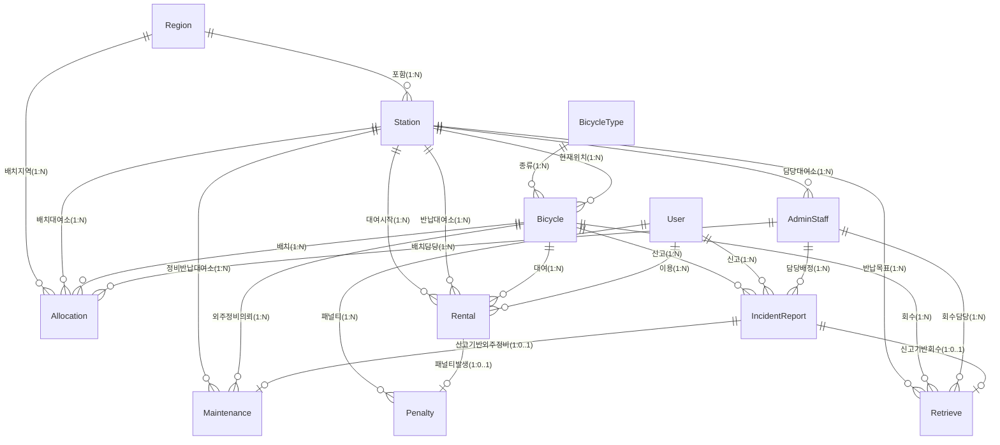

# ERD (Entity-Relationship Diagram)

## 시흥시 공공 자전거 대여 서비스

설계 기준: `docs/design.md`  
엔터티 수: **12개**  
관계 수: **24개**

---

## ERD 다이어그램



---

## 관계 목록 (카디널리티 상세)

| # | 부모 엔터티 | 자식 엔터티 | 카디널리티 | FK 컬럼 | 비고 |
|---|------------|------------|-----------|---------|------|
| 1 | Region | Station | 1:N | `Station.region_id` | 한 지역에 여러 대여소 |
| 2 | Region | Allocation | 1:N | `Allocation.region_id` | 지역 단위 배치 관리 |
| 3 | BicycleType | Bicycle | 1:N | `Bicycle.type_id` | 종류별 자전거 분류 |
| 4 | Station | Bicycle | 1:N | `Bicycle.current_station_id` | 현재 위치 (NULL 가능) |
| 5 | Station | AdminStaff | 1:N | `AdminStaff.station_id` | 담당 대여소 (관리자는 NULL 가능) |
| 6 | Station | Rental | 1:N | `Rental.start_station_id` | 대여 시작 대여소 |
| 7 | Station | Rental | 1:N | `Rental.end_station_id` | 반납 대여소 (NULL 가능, 대여중) |
| 8 | Station | Retrieve | 1:N | `Retrieve.target_station_id` | 회수 목표 대여소 |
| 9 | Station | Allocation | 1:N | `Allocation.station_id` | 배치 대여소 (NULL 가능) |
| 10 | Station | Maintenance | 1:N | `Maintenance.return_station_id` | 외주 정비 완료 후 자전거 반납 대여소 (NULL 가능) |
| 11 | Bicycle | Rental | 1:N | `Rental.bicycle_id` | 자전거 대여 이력 |
| 12 | Bicycle | IncidentReport | 1:N | `IncidentReport.bicycle_id` | 자전거 신고 이력 |
| 13 | Bicycle | Maintenance | 1:N | `Maintenance.bicycle_id` | 자전거 외주 정비 의뢰 이력 |
| 14 | Bicycle | Retrieve | 1:N | `Retrieve.bicycle_id` | 자전거 회수 이력 |
| 15 | Bicycle | Allocation | 1:N | `Allocation.bicycle_id` | 자전거 배치 이력 |
| 16 | User | Rental | 1:N | `Rental.user_id` | 사용자 대여 이력 |
| 17 | User | IncidentReport | 1:N | `IncidentReport.user_id` | 사용자 신고 이력 (NULL 가능) |
| 18 | User | Penalty | 1:N | `Penalty.user_id` | 사용자 패널티 이력 |
| 19 | Rental | Penalty | 1:0..1 | `Penalty.rental_id` (UNIQUE) | 미반납 1건당 패널티 1건 |
| 20 | AdminStaff | IncidentReport | 1:N | `IncidentReport.assigned_staff_id` | 담당 배정 (NULL 가능) |
| 21 | AdminStaff | Retrieve | 1:N | `Retrieve.staff_id` | 회수 담당자 (NULL 가능) |
| 22 | AdminStaff | Allocation | 1:N | `Allocation.allocated_by` | 배치 담당자 |
| 23 | IncidentReport | Maintenance | 1:0..1 | `Maintenance.incident_id` (NULL 가능) | 신고 기반 외주 정비 연계 |
| 24 | IncidentReport | Retrieve | 1:0..1 | `Retrieve.incident_id` (NULL 가능) | 신고 기반 회수 연계 |

---

## 엔터티 의존성 계층

```
[ 최상위 독립 엔터티 ]
    Region          BicycleType

[ 1차 의존 ]
    Station (→ Region)
    Bicycle (→ BicycleType, Station)

[ 2차 의존 ]
    User
    AdminStaff (→ Station)

[ 3차 의존 (핵심 트랜잭션) ]
    Rental        (→ User, Bicycle, Station)
    IncidentReport (→ User, Bicycle, AdminStaff)

[ 4차 의존 (운영 이력) ]
    Maintenance   (→ Bicycle, Station, IncidentReport)   ※ 외주 정비: AdminStaff 참조 없음
    Retrieve      (→ Bicycle, AdminStaff, IncidentReport, Station)
    Penalty       (→ User, Rental)
    Allocation    (→ Bicycle, Region, Station, AdminStaff)
```
